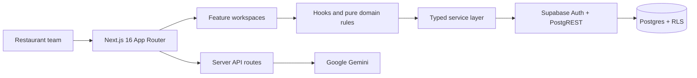

# Motto SaaS

**A multi-tenant, AI-assisted cost and operations management platform for restaurants and cafés.**

[Türkçe](README.md) · [English](README.en.md)

[](https://github.com/Libertus07/motto-saas/actions/workflows/ci.yml)


[Live application](https://motto-saas.vercel.app) · [Security model](docs/security/SEC-101-tenant-model.md) · [Engineering contract](AGENTS.md)

> [!IMPORTANT]
> Motto SaaS is under active development. Application contracts and the database schema may change before `1.0.0`.

## Table of contents

- [About the product](#about-the-product)
- [Core capabilities](#core-capabilities)
- [Architecture](#architecture)
- [Technology stack](#technology-stack)
- [Repository structure](#repository-structure)
- [Quick start](#quick-start)
- [Environment variables](#environment-variables)
- [Local Supabase](#local-supabase)
- [Development commands](#development-commands)
- [Spec-driven development](#spec-driven-development)
- [Testing and quality](#testing-and-quality)
- [Security](#security)
- [Deployment](#deployment)
- [Contributing](#contributing)
- [License](#license)

## About the product

Motto SaaS helps restaurant and café teams manage inventory, recipes, product costs, pricing, suppliers, cash operations, investments, and reporting from a single workspace.

The platform turns fragmented operational data into consistent cost and profitability insights. Each organization's data is isolated through Supabase Row Level Security (RLS), tenant-aware RPC functions, and cross-tenant integrity constraints.

## Core capabilities

| Domain                  | Capabilities                                                                                                       |
| ----------------------- | ------------------------------------------------------------------------------------------------------------------ |
| Artificial intelligence | Receipt and invoice analysis, Z-report extraction, recipe suggestions, menu analysis, and automatic categorization |
| Inventory               | Raw-material tracking, stock movements, critical-stock visibility, and waste/loss analysis                         |
| Recipes and products    | Raw-material, semi-finished, and final-product recipes with automatic food-cost calculations                       |
| Pricing                 | Overhead allocation, contribution margin, suggested price, break-even, and product portfolio analysis              |
| Finance                 | Cash counts, expenses, supplier ledger movements, investment receipts, and financial reports                       |
| Operations              | Turkish product experience, mobile-ready workspaces, guided onboarding, and activity history                       |
| Security                | Organization-level isolation, RLS, atomic RPC mutations, and an audit-log contract                                 |

## Architecture



- `src/app/` is reserved for routes, layouts, server boundaries, and feature composition.
- Domain behavior lives under `src/features/<feature>/` and is separated into components, hooks, services, types, and pure utilities where useful.
- Critical multi-table operations run through migration-defined atomic RPC functions instead of sequential browser requests.
- Files under `supabase/migrations/` provide a forward-only, reproducible database history.

See [AGENTS.md](AGENTS.md), [src/AGENTS.md](src/AGENTS.md), and [supabase/AGENTS.md](supabase/AGENTS.md) for the detailed engineering boundaries.

## Technology stack

| Layer                   | Technology                                                         |
| ----------------------- | ------------------------------------------------------------------ |
| Web application         | Next.js 16.2, React 19.2, TypeScript 5                             |
| Styling and UI          | Tailwind CSS 4, shadcn/ui conventions, Lucide Icons                |
| Data and identity       | Supabase, PostgreSQL, Auth, RLS, and RPC                           |
| Artificial intelligence | Google Gemini                                                      |
| Charts                  | Recharts                                                           |
| PWA                     | `@ducanh2912/next-pwa`                                             |
| Testing                 | Vitest, SQL contract tests, and RLS tests                          |
| Quality                 | ESLint, Prettier, TypeScript strict checks, Husky, and lint-staged |
| CI/CD                   | GitHub Actions and Vercel                                          |

[package.json](package.json) and [package-lock.json](package-lock.json) are the sources of truth for exact dependency versions.

## Repository structure

```text
motto-saas/
├── .github/workflows/       # CI quality gates
├── docs/security/           # Security decisions and tenant model
├── public/                  # Static and PWA assets
├── src/
│   ├── app/                 # App Router pages and API routes
│   ├── components/          # Application-wide shared UI
│   ├── context/             # Global providers
│   ├── features/            # Domain-focused feature modules
│   ├── hooks/               # Application-wide shared hooks
│   └── lib/                 # Shared infrastructure and utilities
├── supabase/
│   ├── migrations/          # Forward-only database changes
│   └── tests/               # SQL security and RPC contract tests
├── tests/                   # Application-level integration tests
├── AGENTS.md                # Repository engineering contract
└── package.json             # Commands and dependencies
```

## Quick start

### Prerequisites

- Node.js `22.x`
- npm `10+`
- A Supabase project, or Docker Desktop for local development
- A Google Gemini API key for AI-powered features

### Installation

```bash
git clone https://github.com/Libertus07/motto-saas.git
cd motto-saas
npm ci
cp .env.example .env.local
npm run dev
```

For Windows PowerShell, use the following copy command:

```powershell
Copy-Item .env.example .env.local
```

The application is available at [http://localhost:3000](http://localhost:3000) by default.

## Environment variables

Use [.env.example](.env.example) as the starting point.

| Variable                         | Required                                               | Scope           | Purpose                             |
| -------------------------------- | ------------------------------------------------------ | --------------- | ----------------------------------- |
| `NEXT_PUBLIC_SUPABASE_URL`       | Yes                                                    | Client + server | Supabase project URL                |
| `NEXT_PUBLIC_SUPABASE_ANON_KEY`  | Yes                                                    | Client + server | Public/anon key constrained by RLS  |
| `GEMINI_API_KEY`                 | For AI features                                        | Server only     | Used by Gemini API routes           |
| `SUPABASE_SERVICE_ROLE_KEY`      | For integration tests and privileged maintenance tools | Server only     | Privileged key that can bypass RLS  |
| `DATABASE_URL` or `POSTGRES_URL` | For selected debug/migration tools                     | Server only     | Direct PostgreSQL connection string |

> [!CAUTION]
> Never prefix `SUPABASE_SERVICE_ROLE_KEY`, `DATABASE_URL`, `POSTGRES_URL`, or `GEMINI_API_KEY` with `NEXT_PUBLIC_`. Never expose them to client code or commit them to Git.

## Local Supabase

With Docker running, start the local Supabase services:

```bash
npx supabase@2.111.0 start
npx supabase@2.111.0 migration list --local
```

Copy the local URL and keys printed by the CLI into `.env.local`. Follow [supabase/AGENTS.md](supabase/AGENTS.md) for migration changes, and never rewrite a migration that may already have been applied.

`supabase/config.toml` supports seed loading, but the repository does not distribute sample tenant data. Never derive development fixtures from real customer or production data.

## Development commands

| Command                | Description                                     |
| ---------------------- | ----------------------------------------------- |
| `npm run dev`          | Start the development server                    |
| `npm run format`       | Format supported files with Prettier            |
| `npm run format:check` | Check formatting without modifying files        |
| `npm run lint`         | Run ESLint                                      |
| `npm run typecheck`    | Run the TypeScript type checker                 |
| `npm run test`         | Run the Vitest suite once                       |
| `npm run check`        | Run formatting, lint, types, and tests          |
| `npm run build`        | Produce a production Next.js build with Webpack |
| `npm run start`        | Serve the generated production build            |

## Spec-driven development

Material features, cross-module changes, database contracts, and substantial
refactors are planned with GitHub Spec Kit. The primary Codex workflow is:

1. Use `$speckit-specify` to define user value, scope, and acceptance scenarios.
2. Run `$speckit-clarify` when needed, followed by `$speckit-plan`.
3. Generate verifiable work items with `$speckit-tasks`.
4. Run `$speckit-analyze` for high-risk work before implementation.
5. Implement the approved scope with `$speckit-implement`.

All specifications must comply with the
[Motto SaaS Engineering Constitution](.specify/memory/constitution.md) and the
applicable `AGENTS.md` contracts.

## Testing and quality

Before completing a substantial change, run:

```bash
npm run check
npm run build
```

The suite covers pure business rules, feature services, RPC signatures, and tenant/RLS contracts. `tests/rls.integration.test.ts` skips safely when the required Supabase environment variables are unavailable; run it against a local or isolated test project for complete security verification.

GitHub Actions installs dependencies with `npm ci`, runs the quality gates, and creates a separate production build for every `master`/`main` push and pull request.

## Security

- Tenant data is scoped through organization identity and verified membership.
- Tenant tables in exposed schemas are protected by RLS policies.
- Multi-table financial and inventory operations use atomic RPC functions.
- Privileged credentials are limited to trusted server and test boundaries.
- Successful data mutations are subject to the audit-log contract.
- Live customer data must never be used as debug, seed, or automated test data.

Read [SEC-101 — Tenant Model and Data Ownership](docs/security/SEC-101-tenant-model.md) for the threat model, ownership rules, and security verification scenarios.

Do not include credentials, tenant data, or sensitive logs in a public issue. Use GitHub Private Vulnerability Reporting when enabled, or contact the repository owner through a private channel.

## Deployment

The application can be deployed to Vercel as a Next.js project:

1. Connect the GitHub repository to a Vercel project.
2. Configure environment variables separately for Preview and Production.
3. Use `npm run build` as the build command.
4. Verify that the target environment matches the committed Supabase migration history.
5. Test authentication, tenant isolation, and critical mobile flows on the Preview deployment.

The build must not depend on credentials for a live Supabase project; GitHub CI verifies this contract with placeholder values.

## Contributing

1. Create an issue or working note that describes the scope.
2. Open a short-lived feature branch.
3. Follow the root and nearest nested `AGENTS.md` files.
4. Add tests for behavior changes.
5. Run `npm run check` and `npm run build`.
6. Open a pull request with small, descriptive commits.

Refactors must preserve observable behavior. Security, RPC, or database-contract changes must include migrations and denial-path tests.

## License

This repository does not currently declare an open-source license. All rights are reserved by the repository owner until a license is added.
