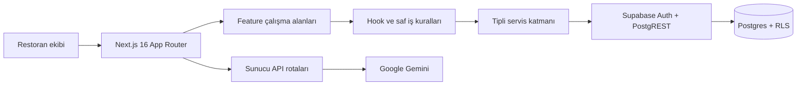

# Motto SaaS

**Restoran ve kafeler için çok kiracılı (multi-tenant), yapay zekâ destekli maliyet ve operasyon yönetim platformu.**

[Türkçe](README.md) · [English](README.en.md)

[](https://github.com/Libertus07/motto-saas/actions/workflows/ci.yml)


[Canlı uygulama](https://motto-saas.vercel.app) · [Güvenlik modeli](docs/security/SEC-101-tenant-model.md) · [Geliştirme kuralları](AGENTS.md)

> [!IMPORTANT]
> Motto SaaS aktif geliştirme aşamasındadır. `1.0.0` öncesinde uygulama sözleşmeleri ve veritabanı şeması değişebilir.

## İçindekiler

- [Ürün hakkında](#ürün-hakkında)
- [Öne çıkan yetenekler](#öne-çıkan-yetenekler)
- [Mimari](#mimari)
- [Teknoloji yığını](#teknoloji-yığını)
- [Proje yapısı](#proje-yapısı)
- [Hızlı başlangıç](#hızlı-başlangıç)
- [Ortam değişkenleri](#ortam-değişkenleri)
- [Yerel Supabase](#yerel-supabase)
- [Geliştirme komutları](#geliştirme-komutları)
- [Test ve kalite](#test-ve-kalite)
- [Güvenlik](#güvenlik)
- [Deployment](#deployment)
- [Katkıda bulunma](#katkıda-bulunma)
- [Lisans](#lisans)

## Ürün hakkında

Motto SaaS; restoran ve kafe ekiplerinin stok, reçete, ürün maliyeti, fiyatlandırma, tedarikçi, kasa, yatırım ve raporlama süreçlerini tek bir çalışma alanında yönetmesine yardımcı olur.

Platformun temel amacı, dağınık operasyon verilerini tutarlı maliyet ve kârlılık içgörülerine dönüştürmektir. Her organizasyonun verisi Supabase Row Level Security (RLS), tenant kontrollü RPC fonksiyonları ve çapraz tenant bütünlük kurallarıyla ayrıştırılır.

## Öne çıkan yetenekler

| Alan           | Yetenekler                                                                                    |
| -------------- | --------------------------------------------------------------------------------------------- |
| Yapay zekâ     | Fiş/fatura analizi, Z-Raporu okuma, reçete önerisi, menü analizi ve otomatik kategorilendirme |
| Stok           | Hammadde takibi, stok hareketleri, kritik stok görünümü ve zayi/kayıp analizi                 |
| Reçete ve ürün | Hammadde, yarı mamul ve nihai ürün reçeteleri; otomatik food-cost hesaplama                   |
| Fiyatlandırma  | Genel gider dağıtımı, katkı payı, önerilen satış fiyatı, başa baş ve ürün portföyü analizi    |
| Finans         | Kasa sayımı, gider, tedarikçi cari hareketleri, yatırım fişleri ve finansal raporlar          |
| Operasyon      | Türkçe kullanıcı deneyimi, mobil uyumlu çalışma alanları, eğitim turu ve işlem geçmişi        |
| Güvenlik       | Organizasyon bazlı veri izolasyonu, RLS, atomik RPC işlemleri ve audit-log sözleşmesi         |

## Mimari



- `src/app/` yalnızca rota, layout, sunucu sınırı ve feature bileşimi için kullanılır.
- Alan davranışı `src/features/<feature>/` altında bileşen, hook, servis, tip ve saf yardımcı fonksiyonlara ayrılır.
- Çok tablolı kritik işlemler, tarayıcıdan ardışık istekler yerine migration ile tanımlanan atomik RPC fonksiyonlarında yürütülür.
- Supabase migration dosyaları `supabase/migrations/` altında ileri yönlü ve tekrar üretilebilir şema geçmişini oluşturur.

Ayrıntılı mühendislik sınırları için [AGENTS.md](AGENTS.md), [src/AGENTS.md](src/AGENTS.md) ve [supabase/AGENTS.md](supabase/AGENTS.md) dosyalarına bakın.

## Teknoloji yığını

| Katman         | Teknoloji                                                             |
| -------------- | --------------------------------------------------------------------- |
| Web uygulaması | Next.js 16.2, React 19.2, TypeScript 5                                |
| Stil ve UI     | Tailwind CSS 4, shadcn/ui yaklaşımı, Lucide Icons                     |
| Veri ve kimlik | Supabase, PostgreSQL, Auth, RLS ve RPC                                |
| Yapay zekâ     | Google Gemini                                                         |
| Grafikler      | Recharts                                                              |
| PWA            | `@ducanh2912/next-pwa`                                                |
| Test           | Vitest, SQL sözleşme ve RLS testleri                                  |
| Kalite         | ESLint, Prettier, TypeScript strict kontrolleri, Husky ve lint-staged |
| CI/CD          | GitHub Actions ve Vercel                                              |

Sürüm numaraları için tek doğruluk kaynağı [package.json](package.json) ve [package-lock.json](package-lock.json) dosyalarıdır.

## Proje yapısı

```text
motto-saas/
├── .github/workflows/       # CI kalite kapıları
├── docs/security/           # Güvenlik kararları ve tenant modeli
├── public/                  # Statik ve PWA varlıkları
├── src/
│   ├── app/                 # App Router sayfaları ve API rotaları
│   ├── components/          # Uygulama genelinde paylaşılan UI
│   ├── context/             # Global provider'lar
│   ├── features/            # Alan odaklı feature modülleri
│   ├── hooks/               # Uygulama genelinde paylaşılan hook'lar
│   └── lib/                 # Ortak altyapı ve yardımcılar
├── supabase/
│   ├── migrations/          # İleri yönlü veritabanı değişiklikleri
│   └── tests/               # SQL güvenlik ve RPC sözleşme testleri
├── tests/                   # Uygulama seviyesi entegrasyon testleri
├── AGENTS.md                # Repo genelindeki mühendislik sözleşmesi
└── package.json             # Komutlar ve bağımlılıklar
```

## Hızlı başlangıç

### Gereksinimler

- Node.js `22.x`
- npm `10+`
- Bir Supabase projesi veya yerel geliştirme için Docker Desktop
- Yapay zekâ özellikleri için Google Gemini API anahtarı

### Kurulum

```bash
git clone https://github.com/Libertus07/motto-saas.git
cd motto-saas
npm ci
cp .env.example .env.local
npm run dev
```

Windows PowerShell kullanıyorsanız kopyalama adımı:

```powershell
Copy-Item .env.example .env.local
```

Uygulama varsayılan olarak [http://localhost:3000](http://localhost:3000) adresinde açılır.

## Ortam değişkenleri

Başlangıç noktası olarak [.env.example](.env.example) dosyasını kullanın.

| Değişken                           | Gerekli                                             | Kapsam           | Açıklama                                     |
| ---------------------------------- | --------------------------------------------------- | ---------------- | -------------------------------------------- |
| `NEXT_PUBLIC_SUPABASE_URL`         | Evet                                                | İstemci + sunucu | Supabase proje URL'si                        |
| `NEXT_PUBLIC_SUPABASE_ANON_KEY`    | Evet                                                | İstemci + sunucu | RLS ile sınırlandırılmış public/anon anahtar |
| `GEMINI_API_KEY`                   | AI özellikleri için                                 | Yalnızca sunucu  | Gemini API rotalarında kullanılır            |
| `SUPABASE_SERVICE_ROLE_KEY`        | Entegrasyon testleri ve yetkili bakım araçları için | Yalnızca sunucu  | RLS'i aşabilen ayrıcalıklı anahtar           |
| `DATABASE_URL` veya `POSTGRES_URL` | Bazı debug/migration araçları için                  | Yalnızca sunucu  | Doğrudan PostgreSQL bağlantısı               |

> [!CAUTION]
> `SUPABASE_SERVICE_ROLE_KEY`, `DATABASE_URL`, `POSTGRES_URL` ve `GEMINI_API_KEY` değerlerini hiçbir zaman `NEXT_PUBLIC_` ön ekiyle tanımlamayın, istemci koduna aktarmayın veya Git'e kaydetmeyin.

## Yerel Supabase

Docker çalışırken yerel Supabase servislerini başlatabilirsiniz:

```bash
npx supabase@2.111.0 start
npx supabase@2.111.0 migration list --local
```

Yerel servis çıktısındaki URL ve anahtarları `.env.local` dosyanıza aktarın. Migration değişikliklerinde [supabase/AGENTS.md](supabase/AGENTS.md) kurallarını izleyin; uygulanmış migration dosyalarını geriye dönük değiştirmeyin.

`supabase/config.toml` seed dosyasına izin verir ancak repoda örnek tenant verisi dağıtılmaz. Geliştirme verilerini gerçek müşteri veya üretim verilerinden oluşturmayın.

## Geliştirme komutları

| Komut                  | Açıklama                                             |
| ---------------------- | ---------------------------------------------------- |
| `npm run dev`          | Geliştirme sunucusunu başlatır                       |
| `npm run format`       | Desteklenen dosyaları Prettier ile biçimlendirir     |
| `npm run format:check` | Biçim farklarını dosya değiştirmeden kontrol eder    |
| `npm run lint`         | ESLint denetimini çalıştırır                         |
| `npm run typecheck`    | TypeScript tip kontrolünü çalıştırır                 |
| `npm run test`         | Vitest test paketini bir kez çalıştırır              |
| `npm run check`        | Format, lint, tip ve test kalite kapısını çalıştırır |
| `npm run build`        | Webpack ile production Next.js build'i üretir        |
| `npm run start`        | Üretilmiş production build'i çalıştırır              |

## Test ve kalite

Önemli bir değişikliği tamamlamadan önce:

```bash
npm run check
npm run build
```

Test paketi saf iş kuralları, feature servisleri, RPC imzaları ve tenant/RLS sözleşmelerini kapsar. `tests/rls.integration.test.ts`, gerekli Supabase ortam değişkenleri bulunmadığında güvenli şekilde atlanır; tam güvenlik doğrulaması için yerel veya izole bir test projesine bağlanmalıdır.

GitHub Actions her `master`/`main` push ve pull request'inde bağımlılıkları `npm ci` ile kurar, kalite kapılarını çalıştırır ve ayrı bir production build üretir.

## Güvenlik

- Tenant verileri organizasyon kimliği ve doğrulanmış üyelik üzerinden sınırlandırılır.
- Exposed şemalardaki tenant tabloları RLS politikalarıyla korunur.
- Çok tablolı finansal ve stok işlemleri atomik RPC fonksiyonlarıyla yürütülür.
- Ayrıcalıklı anahtarlar yalnızca güvenilir sunucu/test sınırlarında kullanılır.
- Başarılı veri mutasyonları audit-log sözleşmesine tabidir.
- Canlı müşteri verileri debug, seed veya otomatik test verisi olarak kullanılmaz.

Tehdit modeli, veri sahipliği ve test senaryoları için [SEC-101 — Tenant Modeli ve Veri Sahipliği](docs/security/SEC-101-tenant-model.md) belgesini okuyun.

Bir güvenlik açığı bildirirken kimlik bilgisi, tenant verisi veya hassas logları public issue içerisinde paylaşmayın. GitHub Private Vulnerability Reporting etkinse onu, değilse depo sahibinin özel iletişim kanalını kullanın.

## Deployment

Uygulama Vercel üzerinde Next.js olarak dağıtılabilir:

1. GitHub deposunu Vercel projesine bağlayın.
2. Ortam değişkenlerini Preview ve Production ortamları için ayrı tanımlayın.
3. Build komutu olarak `npm run build` kullanın.
4. Deployment öncesinde Supabase migration geçmişinin hedef ortamla uyumlu olduğunu doğrulayın.
5. Preview deployment üzerinde kimlik doğrulama, tenant izolasyonu ve kritik mobil akışları test edin.

Build işlemi canlı Supabase kimlik bilgilerine ihtiyaç duymamalıdır; GitHub CI bu sözleşmeyi placeholder değerlerle doğrular.

## Katkıda bulunma

1. Değişikliğin kapsamını açıklayan bir issue veya çalışma notu oluşturun.
2. Kısa ömürlü bir feature dalı açın.
3. Kök ve ilgili alt klasördeki `AGENTS.md` kurallarını uygulayın.
4. Davranış değişikliklerine uygun testleri ekleyin.
5. `npm run check` ve `npm run build` komutlarını çalıştırın.
6. Küçük, açıklayıcı commit'lerle pull request açın.

Refactorlar gözlemlenebilir davranışı korumalı; güvenlik, RPC veya veritabanı sözleşmesi değişiklikleri migration ve denial-path testleriyle birlikte gelmelidir.

## Lisans

Bu depoda henüz açık kaynak lisansı tanımlanmamıştır. Bir lisans eklenene kadar tüm haklar depo sahibine aittir.
