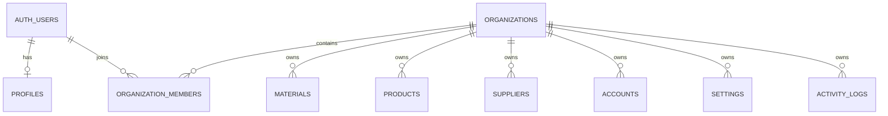

# SEC-101 — Tenant Modeli ve Veri Sahipliği

- **Durum:** Kabul edildi
- **Karar tarihi:** 2026-07-11
- **Kapsam:** Güvenlik ve veri izolasyonu
- **Sonraki iş:** SEC-102 — Supabase RLS politikalarını tenant bazlı yeniden tasarla

## 1. Karar özeti

Motto-SaaS için tenant, bir Auth kullanıcısı değil **işletme/organizasyon** olacaktır.

- `auth.users`: Kimlik doğrulanan kişi ve işlemi yapan aktör
- `organizations`: İş verisinin sahibi olan tenant
- `organization_members`: Kullanıcının organizasyon üyeliği ve rolü
- `organization_id`: Tenant'a ait tüm iş verilerinin izolasyon anahtarı
- `user_id`, `created_by`, `updated_by`, `performed_by`: Tenant sahipliği değil, audit/aktör bilgisi

Bir kullanıcı birden fazla organizasyona üye olabilir. Bir organizasyonda birden fazla kullanıcı bulunabilir.



## 2. Bugünkü durum

Uygulama bugün fiilen **tek işletmeli ve ortak veri havuzlu** çalışmaktadır.

`rls_policy.sql` ana tablolarda yalnızca şu koşulu kullanır:

```sql
USING (auth.role() = 'authenticated')
WITH CHECK (auth.role() = 'authenticated')
```

Bu politika tenant izolasyonu sağlamaz. Her authenticated kullanıcı, politika kapsamındaki tüm satırlara erişebilir. Bazı eski SQL dosyalarında RLS'nin kapatıldığı veya `USING (true)` politikalarının bulunduğu desenler de vardır.

Kod tabanında şu yapılar bulunmamaktadır:

- `organizations`
- `organization_members`
- `profiles`
- tenant claim veya aktif organizasyon bağlamı
- `organization_id` tabanlı sorgu/RLS politikası
- kullanıcı ile organizasyon üyeliğini doğrulayan yetki katmanı

### Güvenlik sonucu

İkinci bir authenticated kullanıcı oluşturulursa bu kullanıcı mevcut işletmenin verilerini okuyabilir ve geniş ölçüde değiştirebilir/silebilir. Multi-tenant kullanıma SEC-102 tamamlanmadan geçilmemelidir.

## 3. Neden tenant kullanıcı değildir?

`user_id` değerini tenant anahtarı olarak kullanmak reddedilmiştir.

Gerekçeler:

1. Aynı işletmede birden fazla personel çalışabilmelidir.
2. Bir kullanıcı birden fazla işletmeye erişebilmelidir.
3. Kullanıcı silinse veya üyeliği kapatılsa bile işletme verisi korunmalıdır.
4. İşlemi yapan kişi ile verinin sahibi farklı kavramlardır.
5. Rol ve yetkiler üyelik üzerinden yönetilmelidir.

Mevcut `user_id` alanları semantik olarak `created_by` veya `performed_by` kabul edilmelidir. Yeni güvenlik tasarımında aktör değeri istemciden güvenilir kabul edilmemeli, mümkün olan her yerde `auth.uid()` ile atanmalıdır.

## 4. Temel tenant tabloları

### 4.1 `organizations`

Önerilen minimum alanlar:

```sql
id uuid primary key default gen_random_uuid(),
name text not null,
slug text not null unique,
logo_url text,
tax_no text,
address text,
phone text,
created_by uuid not null references auth.users(id),
created_at timestamptz not null default now(),
updated_at timestamptz not null default now()
```

İşletme kimliği niteliğindeki alanlar burada tutulur. Uygulama tercihleri `settings` tablosunda kalır.

### 4.2 `organization_members`

Önerilen minimum alanlar:

```sql
organization_id uuid not null references organizations(id) on delete cascade,
user_id uuid not null references auth.users(id) on delete cascade,
role text not null check (role in ('owner', 'admin', 'manager', 'staff', 'accountant')),
status text not null default 'active' check (status in ('active', 'invited', 'suspended')),
created_at timestamptz not null default now(),
primary key (organization_id, user_id)
```

### 4.3 `profiles`

Tenant'tan bağımsız kullanıcı bilgilerini tutar:

```sql
id uuid primary key references auth.users(id) on delete cascade,
display_name text,
avatar_url text,
phone text,
created_at timestamptz not null default now(),
updated_at timestamptz not null default now()
```

## 5. Veri sahipliği envanteri

Aşağıdaki tablolarda `organization_id uuid not null` doğrudan bulunmalıdır. İlişki tablolarında tenant ebeveynden türetilebilse bile doğrudan kolon kullanılması RLS sadeliği, sorgu performansı ve savunma katmanı nedeniyle tercih edilmiştir.

| Tablo | Sahiplik | Aktör alanı | Not |
|---|---|---|---|
| `settings` | Doğrudan `organization_id` | `updated_by` | PK/unique `(organization_id, key)` olmalı |
| `materials` | Doğrudan `organization_id` | `created_by`, `updated_by` | İsim eşleştirmeleri tenant içinde yapılmalı |
| `products` | Doğrudan `organization_id` | `created_by`, `updated_by` | Ürün kataloğu tenant'a aittir |
| `sub_recipes` | Doğrudan `organization_id` | `created_by`, `updated_by` | Yarı mamul/reçete tenant'a aittir |
| `sub_recipe_ingredients` | Doğrudan `organization_id` | Yok | Parent ilişkileri aynı tenant'ta olmalı |
| `product_ingredients` | Doğrudan `organization_id` | Yok | Product/material/sub-recipe tenant'ları eşleşmeli |
| `suppliers` | Doğrudan `organization_id` | `created_by`, `updated_by` | Finansal ve iletişim verisi içerir |
| `supplier_transactions` | Doğrudan `organization_id` | `performed_by` | Supplier ile aynı tenant zorunlu |
| `expenses` | Doğrudan `organization_id` | `created_by`, `updated_by` | Finansal kayıt |
| `sales` | Doğrudan `organization_id` | `created_by` | Batch işlemleri tenant ile sınırlandırılmalı |
| `accounts` | Doğrudan `organization_id` | `created_by`, `updated_by` | Finans hareketlerinin sahiplik kökü |
| `account_movements` | Doğrudan `organization_id` | `performed_by` | Account ile aynı tenant zorunlu |
| `stock_movements` | Doğrudan `organization_id` | `performed_by` | Manuel ve çok kaynaklı hareketler nedeniyle zorunlu |
| `material_price_history` | Doğrudan `organization_id` | `created_by` | Material ile aynı tenant zorunlu |
| `investments` | Doğrudan `organization_id` | `created_by`, `updated_by` | `asset_type` aramaları tenant içinde yapılmalı |
| `investment_transactions` | Doğrudan `organization_id` | `performed_by` | Investment/account aynı tenant'ta olmalı |
| `cash_reconciliations` | Doğrudan `organization_id` | `performed_by` | Unique `(organization_id, date)` olmalı |
| `activity_logs` | Doğrudan `organization_id` | `user_id`/`performed_by` | Audit kayıtları tenant dışına sızmamalı |
| `ingredients` | Doğrudan `organization_id` | Belirlenecek | Legacy/kullanım durumu migration öncesi doğrulanmalı |
| `recipes` | Doğrudan `organization_id` | Belirlenecek | Legacy/kullanım durumu migration öncesi doğrulanmalı |
| `price_calculations` | Doğrudan `organization_id` | Belirlenecek | Legacy/kullanım durumu migration öncesi doğrulanmalı |

### Canlı şema doğrulaması gereken tablolar

Repository, Supabase şemasının tam ve sıralı migration geçmişini içermemektedir. Aşağıdaki tabloların eksiksiz `CREATE TABLE` tanımları repoda doğrulanamamıştır:

- `suppliers`
- `expenses`
- `sales`
- `stock_movements`
- `accounts`
- `account_movements`
- `material_price_history`
- `ingredients`
- `recipes`
- `price_calculations`

SEC-102 migration'ı yazılmadan önce canlı şema; kolon, constraint, foreign key, trigger ve mevcut politika envanteriyle dışa aktarılmalıdır.

## 6. Cross-tenant ilişki bütünlüğü

Tek başına ayrı `organization_id` ve `material_id` foreign keyleri, bu iki değerin aynı organizasyona ait olduğunu garanti etmez.

Kritik ilişkilerde bileşik foreign key kullanılmalıdır:

```sql
alter table materials
    add constraint materials_organization_id_id_key
    unique (organization_id, id);

alter table stock_movements
    add constraint stock_movements_material_tenant_fk
    foreign key (organization_id, material_id)
    references materials (organization_id, id);
```

Aynı desen şu ilişkiler için uygulanmalıdır:

- product ingredient → product/material/sub-recipe
- sub-recipe ingredient → sub-recipe/material
- supplier transaction → supplier
- stock movement → material/supplier
- account movement → account
- investment transaction → investment/account
- material price history → material

Polimorfik `source_id` ve FK'siz `batch_id` ilişkileri tenant kontrolü olmadan kullanılmamalıdır.

## 7. SEC-102 için RLS sözleşmesi

RLS, yalnızca `authenticated` rolünü değil aktif organizasyon üyeliğini doğrulamalıdır.

Okuma için temel politika:

```sql
using (
    exists (
        select 1
        from organization_members om
        where om.organization_id = target_table.organization_id
          and om.user_id = auth.uid()
          and om.status = 'active'
    )
)
```

Insert/update için aynı kontrol `with check` içinde uygulanmalıdır.

### Rol tabanlı yazma

Başlangıç yetki matrisi:

| Rol | Okuma | Operasyonel yazma | Finansal yazma | Üye/ayar yönetimi |
|---|---:|---:|---:|---:|
| `owner` | Evet | Evet | Evet | Evet |
| `admin` | Evet | Evet | Evet | Evet, owner hariç |
| `manager` | Evet | Evet | Sınırlı | Hayır |
| `staff` | Evet | Sınırlı | Hayır | Hayır |
| `accountant` | Evet | Hayır | Evet | Hayır |

Detaylı tablo/işlem matrisi SEC-102 içinde kesinleştirilecektir.

### RPC kuralları

Tenant verisine yazan bütün RPC'ler:

1. Aktörü `auth.uid()` ile belirlemeli.
2. Hedef `organization_id` için aktif üyeliği doğrulamalı.
3. Her `select`, `insert`, `update` ve `delete` işleminde tenant sınırı kullanmalı.
4. Tenant veya aktör kimliğini doğrulamadan istemci payload'ına güvenmemeli.
5. `limit 1`, isim eşleşmesi, `batch_id` ve `source_id` sorgularını tenant ile sınırlandırmalı.
6. Audit kaydına `organization_id` ve `performed_by` yazmalı.

Özellikle gözden geçirilecek RPC'ler:

- `process_receipt_upload`
- `delete_receipt_transaction`
- `delete_z_report_transaction`
- `buy_investment_transaction`
- `process_cash_reconciliation`
- tedarikçi ödeme/silme RPC'leri
- stok hareketi ve sayım RPC'leri

## 8. Uygulama bağlamı

Uygulama, girişten sonra kullanıcının aktif organizasyonunu belirlemelidir.

Önerilen davranış:

1. Kullanıcının aktif üyelikleri yüklenir.
2. Tek üyelik varsa otomatik seçilir.
3. Birden fazla üyelik varsa son kullanılan organizasyon seçilir veya kullanıcıya seçim yaptırılır.
4. Aktif `organization_id` uygulama context'inde tutulur.
5. İstemci sorguları performans ve açıklık için `.eq('organization_id', activeOrganizationId)` kullanır.
6. Güvenliğin asıl garantisi her zaman RLS olur; istemci filtresi güvenlik sınırı sayılmaz.

## 9. Storage sahipliği

İşletme belgeleri tenant yolu altında tutulmalıdır:

```text
{organization_id}/logos/...
{organization_id}/receipts/...
{organization_id}/z-reports/...
```

- Fiş ve finans belgeleri public bucket'ta tutulmamalıdır.
- Okuma için signed URL tercih edilmelidir.
- Storage RLS, path'in ilk parçasındaki `organization_id` ile aktif üyeliği doğrulamalıdır.
- Dosyanın `owner` kullanıcısı olmak tenant üyeliğinin yerine geçmez.

## 10. Legacy veri migrasyonu

Mevcut veri tek bir legacy organizasyona bağlanacaktır.

Önerilen sıra:

1. `organizations`, `organization_members` ve `profiles` tablolarını oluştur.
2. Bir legacy organization oluştur.
3. Mevcut Auth kullanıcılarını doğrulanmış rolleriyle legacy organizasyona bağla.
4. İş tablolarına nullable `organization_id` ekle.
5. Mevcut satırları legacy organization ile backfill et.
6. Orphan ve cross-table tutarsızlıklarını denetle.
7. Global constraint'leri tenant bazlı hale getir.
8. Bileşik foreign key ve indeksleri ekle.
9. RPC'leri tenant-aware hale getir.
10. Uygulama organization context'ini devreye al.
11. Tenant RLS politikalarını oluştur ve eski permissive politikaları kaldır.
12. `organization_id` kolonlarını `not null` yap.
13. İki organizasyon ve iki kullanıcıyla negatif izolasyon testlerini çalıştır.

### Değişmesi gereken global constraint'ler

- `settings`: `primary key (key)` → `primary key (organization_id, key)`
- `cash_reconciliations`: `unique (date)` → `unique (organization_id, date)`
- Tenant içinde benzersiz olması gereken katalog alanları: `(organization_id, normalized_name)` veya eşdeğeri

## 11. Güvenlik doğrulama senaryoları

SEC-102 tamamlanma testlerinde en az iki organization ve iki kullanıcı kullanılmalıdır.

| Senaryo | Beklenen sonuç |
|---|---|
| A kullanıcısı A organizasyonunun verisini okur | Başarılı |
| A kullanıcısı B organizasyonunun UUID'siyle select yapar | 0 satır |
| A kullanıcısı B organizasyonuna insert yapar | RLS hatası |
| A kullanıcısı B organizasyonundaki kaydı update/delete eder | RLS hatası veya 0 satır |
| A kullanıcısı B tenant'ına ait parent ID ile child kayıt oluşturur | FK/RLS hatası |
| Üyeliği suspended kullanıcı tenant verisini okur | 0 satır |
| RPC'ye başka kullanıcıya ait `user_id` gönderilir | Değer yok sayılır; aktör `auth.uid()` olur |
| Storage path'inde başka organization ID kullanılır | RLS hatası |
| Aynı ayar anahtarı iki organization'da oluşturulur | Başarılı, birbirinden bağımsız |
| Aynı gün iki organization için kasa mutabakatı oluşturulur | Başarılı, birbirinden bağımsız |

## 12. Bilinen mevcut riskler

SEC-102 öncesinde özellikle ele alınması gereken riskler:

- `rls_policy.sql` tenant yerine yalnızca authenticated kontrolü yapıyor.
- Bazı eski SQL dosyaları RLS'yi kapatıyor veya public politika oluşturuyor.
- `process_receipt_upload`, aktör kimliğini istemci payload'ından alabiliyor.
- İsim, `batch_id`, `source_id` ve `limit 1` sorguları tenant sınırı olmadan çalışıyor.
- `settings.key` ve `cash_reconciliations.date` global constraint niteliğinde.
- Storage belgeleri tenant path/RLS modeli olmadan tutuluyor.
- Repository düzenli ve eksiksiz bir migration geçmişi sunmuyor.

## 13. SEC-101 kabul kriterleri

- [x] Sistemin bugünkü tenancy modeli yazılı olarak netleştirildi.
- [x] Hedef tenant biriminin organization/işletme olduğu kararlaştırıldı.
- [x] Auth kullanıcısı, tenant ve aktör kavramları ayrıldı.
- [x] `organization_id` gereken tablolar listelendi.
- [x] Cross-tenant foreign key yaklaşımı tanımlandı.
- [x] SEC-102 için temel RLS sözleşmesi tanımlandı.
- [x] Legacy backfill ve migration sırası belirlendi.
- [x] Cross-tenant negatif test senaryoları yazıldı.

## 14. SEC-101 kapsamı dışında kalanlar

Bu karar dokümanı canlı veritabanında değişiklik yapmaz. Aşağıdaki işler SEC-102 ve takip eden migration görevlerinin kapsamındadır:

- Yeni tenant tablolarının oluşturulması
- `organization_id` kolonlarının eklenmesi/backfill edilmesi
- Uygulama organization context'i
- RLS politika değişiklikleri
- RPC tenant izolasyonu
- Storage politika değişiklikleri
- Canlı iki kullanıcı/iki organization güvenlik testleri
