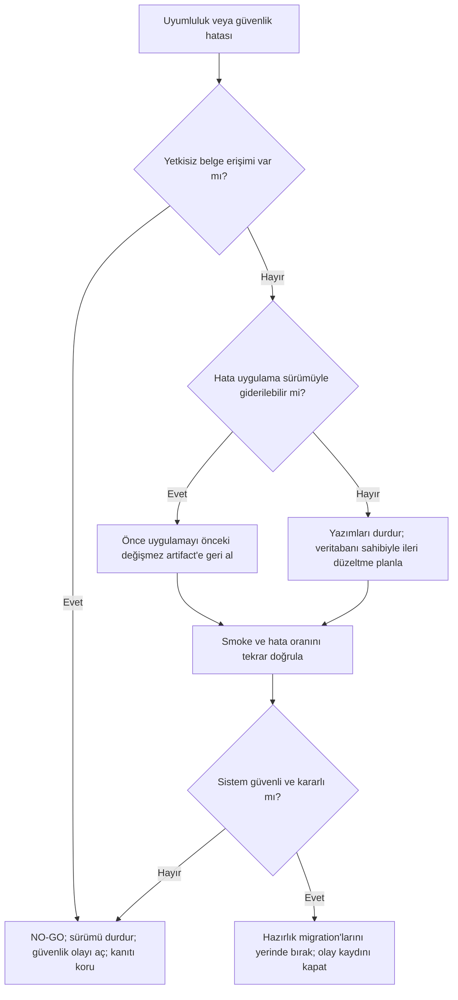

# Özel Finansal Belge Geçiş ve Geri Alma Runbook'u

- **Durum:** Operasyon şablonu; üretim yetkisi vermez
- **Kapsam:** Tedarikçi fişi, Z raporu, yatırım fişi ve yatırım belgesi
- **Hazırlık migration'ı:** `20260807205150_prepare_private_financial_documents.sql`
- **Uyumluluk migration'ı:** `20260807231139_secure_atomic_financial_receipt_writes.sql`
- **Uygulama referansı:** `108f36d920f43f0c7295e107a21214ea3b21803d`
- **Zaman standardı:** Tüm operasyon kayıtları ISO 8601 ve açık saat dilimiyle tutulur

> [!CAUTION]
> Bu belge üretimde migration çalıştırma, uygulama dağıtma, bucket değiştirme, müşteri verisine erişme veya
> Task 8'i başlatma yetkisi değildir. Canlı çalışma için kullanıcıdan yeni ve doğrudan onay, hedef ortamın
> doğrulanması ve bu belgedeki `GO / NO-GO` kaydının tamamlanması gerekir. Başarılı bir hazırlık veya dağıtım,
> enforcement onayı anlamına gelmez.

## 1. Amaç ve güvenlik değişmezleri

Bu runbook, finansal belgelerin yeni yazımlarda kalıcı `storage://<bucket>/<tenant-path>` referanslarıyla
saklanmasına geçerken eski `data:` ve güvenilir public Storage URL'lerinin okunabilir kalmasını sağlayan iki
aşamalı sürümü yönetir. Hedef, uygulama uyumluluğunu gözlemlemek ve bucket'ları özel hale getirecek Task 8'i
ayrı bir açık onay kapısının arkasında tutmaktır.

Aşağıdaki değişmezlerden biri sağlanmıyorsa sonuç `NO-GO` olur:

1. Belgenin tenant'ı `organization_id` ile belirlenir; tarayıcıdan gelen kimlik tek başına yetki değildir.
2. Aktif aynı organizasyon üyesi izinli akışları kullanabilir; organizasyon dışındaki kullanıcı ve askıya alınmış
   üye kullanamaz.
3. Yeni dosyalar yalnız organizasyon kapsamlı yola yüklenir ve veritabanına `storage://` referansı yazılır.
4. Kısa ömürlü imzalı URL yalnız görüntüleme anında üretilir; veritabanına, loga veya kanıt paketine yazılmaz.
5. Eski `data:` ve güvenilir public URL değerleri hazırlık aşamasında değiştirilmez veya silinmez.
6. `motto_assets` ve `receipts` bucket'ları Task 8 onayından önce özel hale getirilmez.
7. Enforcement migration'ı bu runbook'un uyumluluk aşamasının parçası değildir.
8. Her başarısız güvenlik testi, yanlış tenant erişimi veya yeni yazımda legacy referans üretimi doğrudan
   `NO-GO` ve uygulama geri alma değerlendirmesidir.

## 2. Terimler, ortamlar ve sorumluluklar

### 2.1 Ortam adları

Gerçek platform adları bu belgede varsayılmaz. Operasyon kaydında aşağıdaki mantıksal adların karşısına gerçek,
doğrulanmış değer yazılır:

| Mantıksal ad      | Kaydedilecek gerçek değer        | Kullanım                                            |
| ----------------- | -------------------------------- | --------------------------------------------------- |
| `LOCAL`           | Yerel çalışma dizini ve commit   | Migration, pgTAP, advisor ve uygulama kalite kanıtı |
| `TARGET`          | `<TARGET_ENVIRONMENT_NAME>`      | Uyumlu sürümün uygulanacağı ortam                   |
| `TARGET_SUPABASE` | `<EXPECTED_PROJECT_REF>`         | Bağlı Supabase hedefinin değişmez kimliği           |
| `TARGET_APP`      | `<EXPECTED_APPLICATION_PROJECT>` | Uygulama dağıtım hedefinin değişmez kimliği         |

`<...>` biçimindeki bir değer doldurulmadan veya gerçek hedef iki kişi tarafından doğrulanmadan canlı komut
çalıştırılmaz. Ortam adı, URL veya bağlantı dosyası tek başına yeterli doğrulama değildir; proje kimliği ve
onaylanan release kaydı birlikte eşleşmelidir.

### 2.2 Operasyon rolleri

Kişi isimleri önceden varsayılmaz; her rol için gerçek sorumlu release kaydında atanır.

| Rol                        | Sorumluluk                                                                       |
| -------------------------- | -------------------------------------------------------------------------------- |
| **Sürüm sahibi**           | Zaman çizelgesi, iletişim, `GO / NO-GO`, kanıt paketinin bütünlüğü               |
| **Veritabanı sahibi**      | Hedef doğrulama, backup/recovery hazırlığı, migration dry-run ve uygulama kanıtı |
| **Uygulama sahibi**        | Değişmez uygulama artifact'i, dağıtım, smoke test ve uygulama geri alma          |
| **Güvenlik doğrulayıcısı** | Tenant negatif testleri, signed URL davranışı, loglarda sır sızıntısı denetimi   |
| **Geri alma karar sahibi** | Durdurma eşikleri, uygulama rollback kararı ve olay kaydının korunması           |

Aynı kişi birden fazla rol üstlenebilir; ancak hedef doğrulama ve güvenlik sonucu en az iki ayrı göz tarafından
onaylanmalıdır. Bir rol boşsa sonuç `NO-GO` olur.

## 3. Değişmez release artifact'leri

### 3.1 Hazırlık artifact'i

- Kaynak commit: `d621da1fbd9d71e1977b77b546e76ffda890721a`
- Beklenen tek yeni migration:
  `supabase/migrations/20260807205150_prepare_private_financial_documents.sql`
- Amaç: legacy belge eşlemesini oluşturmak, tenant kontrollü Storage politikalarını eklemek ve mevcut bucket
  public durumunu değiştirmeden uyumlu okuma/yazma zeminini hazırlamak.

Hazırlık migration'ı geriye uyumludur ve uygulama rollback'inde normal olarak yerinde bırakılır. Bu ifade,
migration'ın kontrolsüz uygulanmasına izin vermez.

### 3.2 Uyumlu uygulama artifact'i

- Kaynak commit: `108f36d920f43f0c7295e107a21214ea3b21803d`
- Uyumluluk migration'ını ekleyen commit: `1e8a8ea6bd66537c6e0439cab06b2252dd86b0c7` (uygulama artifact'inin
  ancestor'ı)
- Ek uyumluluk migration'ı:
  `supabase/migrations/20260807231139_secure_atomic_financial_receipt_writes.sql`
- İlgili uygulama servisleri:
  - `src/features/documents/document-reference.ts`
  - `src/features/documents/document-storage-service.ts`
  - `src/features/documents/financial-document-write-service.ts`
  - `src/features/documents/useDocumentPreview.ts`

Uyumluluk migration'ı finansal yazımları tenant atomik RPC'lere bağlar ve yükleme doğrulamasını sıkılaştırır.
Hazırlık artifact'i ile ayrı dry-run yapılmasının nedeni, `supabase db push` komutunun tek migration seçme bayrağı
sunmamasıdır. Her aşamada dry-run çıktısı beklenen migration kümesiyle bire bir eşleşmelidir.

### 3.3 Enforcement artifact'i

Task 8 migration'ı henüz yoktur ve bu runbook kapsamında oluşturulmaz. Dosya adı ancak açık Task 8 onayından
sonra Supabase CLI tarafından üretilir. Beklenen işlem, iki finansal bucket'ı private yapmak ve geniş legacy
politikaları kaldırmaktır; bu işlem uyumluluk dağıtımıyla birleştirilemez.

## 4. Zorunlu ön koşullar

Sürüm sahibi aşağıdaki maddelerin tamamını kanıt bağlantısıyla işaretlemeden hazırlık aşaması başlamaz:

- [ ] Release kaydı benzersiz bir kimlik ve ISO 8601 başlangıç zamanı içeriyor.
- [ ] Beş operasyon rolü gerçek kişilerle atanmış ve iletişim kanalı kaydedilmiş.
- [ ] Bakım ve gözlem penceresi başlangıç/bitiş saatleri ile tanımlanmış.
- [ ] `TARGET`, `TARGET_SUPABASE` ve `TARGET_APP` gerçek kimlikleri iki kişi tarafından doğrulanmış.
- [ ] Hazırlık ve uygulama artifact'lerinin tam commit SHA'ları kaydedilmiş.
- [ ] Migration dosya SHA-256 değerleri release kaydına eklenmiş.
- [ ] Hedef veritabanı için platformun onaylı backup/PITR veya geri dönüş yöntemi hazır ve geri yükleme sahibi
      atanmış; yalnız “backup var” ifadesi yeterli değil.
- [ ] Supabase CLI sürümü tam olarak `2.111.0`.
- [ ] Temiz yerel reset, tüm pgTAP testleri ve security/performance advisor sonuçları kanıtlanmış.
- [ ] `npm run check` ve `npm run build` sonuçları aynı uygulama commit'i için kanıtlanmış.
- [ ] Test organizasyonları/kullanıcıları müşteri verisi kullanmadan hazırlanmış; aktif üye, dış kullanıcı,
      suspended üye ve iki organizasyonlu aktif üye senaryoları mevcut.
- [ ] Legacy doğrulama için salt okunur test kayıtlarının kimlikleri ve önceki referans hash'leri kaydedilmiş.
- [ ] Hata oranı baseline'ı, gözlem süresi ve rollback eşikleri dağıtımdan önce onaylanmış.
- [ ] Uygulamanın önceki değişmez artifact'i ve geri alma prosedürü erişilebilir.

## 5. Yerel kanıt kapısı

Bu komutlar yalnız `LOCAL` ortamında, onaylanan uygulama commit'inde çalıştırılır. `db reset --local` yerel
veritabanını yeniden oluşturur; bağlı veya canlı hedefte kullanılmaz.

```powershell
npx supabase@2.111.0 --version
npx supabase@2.111.0 status
npx supabase@2.111.0 db reset --local
npx supabase@2.111.0 test db --local
npx supabase@2.111.0 db advisors --local --type security --level info
npx supabase@2.111.0 db advisors --local --type performance --level info
npm run check
npm run build
```

Asgari ilgili test dosyaları şunlardır:

- `supabase/tests/private_financial_documents.test.sql`
- `supabase/tests/financial_receipt_writes.test.sql`
- `supabase/tests/advisor_security_hardening.test.sql`
- `supabase/tests/database_advisors.test.sql`
- `src/features/documents/document-reference.test.ts`
- `src/features/documents/document-storage-service.test.ts`
- `src/features/documents/financial-document-write-service.test.ts`
- `src/features/documents/useDocumentPreview.test.ts`
- `src/features/documents/document-preview-boundaries.test.ts`

Çıktılar sır, erişim belirteci, imzalı URL veya müşteri belgesi içermeden kanıt deposuna eklenir. Test sayısı tek
başına yeterli değildir; komut, exit code, commit SHA, başlangıç/bitiş zamanı ve advisor bulgularının sınıflaması
birlikte kaydedilir.

## 6. Hedef doğrulama ve güvenli komut şablonları

Bu bölüm yalnız yeni canlı onay alındıktan sonra yetkili operatör tarafından uygulanabilecek şablondur. Bu
runbook'un hazırlanması sırasında komutlar çalıştırılmaz.

### 6.1 Bağlı hedef preflight'i

```powershell
$expectedProjectRef = '<EXPECTED_PROJECT_REF>'
if ($expectedProjectRef -eq '<EXPECTED_PROJECT_REF>') {
  throw 'Beklenen proje kimliği doldurulmadı.'
}

$actualProjectRef = (Get-Content -Raw 'supabase/.temp/project-ref').Trim()
if ($actualProjectRef -ne $expectedProjectRef) {
  throw "Supabase hedefi eşleşmiyor. Beklenen: $expectedProjectRef; bulunan: $actualProjectRef"
}

npx supabase@2.111.0 --version
npx supabase@2.111.0 migration list --linked
```

Kurallar:

- Bağlantı dosyası yoksa veya kimlik eşleşmiyorsa durulur; otomatik link yapılmaz.
- Komut satırına database URL, parola, access token veya service-role anahtarı yazılmaz.
- `--db-url`, `--password`, `--include-all`, `--include-seed`, `--yes` bu akışta kullanılmaz.
- Migration geçmişinde beklenmeyen `local/remote` farkı varsa history repair yapılmaz; ayrı olay açılır.

### 6.2 Hazırlık migration dry-run ve uygulama kapısı

Hazırlık artifact'inin onaylı çalışma dizininde:

```powershell
$expectedPreparationCommit = 'd621da1fbd9d71e1977b77b546e76ffda890721a'
$actualCommit = (git rev-parse HEAD).Trim()
if ($actualCommit -ne $expectedPreparationCommit) {
  throw 'Hazırlık artifact commit SHA değeri eşleşmiyor.'
}

npx supabase@2.111.0 db push --linked --dry-run
```

Dry-run çıktısında uygulanacak migration listesi **yalnız**
`20260807205150_prepare_private_financial_documents.sql` olmalıdır. Eksik, fazla veya farklı bir migration varsa
sonuç `NO-GO` olur. Veritabanı sahibi ve güvenlik doğrulayıcısı dry-run kanıtını imzaladıktan sonra, ayrıca yeni
canlı uygulama onayı mevcutsa gerçek komut şablonu şöyledir:

```powershell
npx supabase@2.111.0 db push --linked
npx supabase@2.111.0 migration list --linked
```

Komut etkileşimli bırakılır; operatör hedefi son kez görmeden otomatik onay verilmez. Uygulama zamanı, CLI exit
code'u ve remote migration listesi kanıt kaydına yazılır.

### 6.3 Hazırlık sonrası, eski uygulama uyumluluk kapısı

Hazırlık migration'ı uygulandıktan sonra **uyumluluk migration'ı veya yeni uygulama dağıtılmadan önce**, halen
yayında olan eski uygulama sürümüyle ayrı bir geriye uyumluluk kapısı çalıştırılır. Test, yalnız sentetik belge ve
önceden tanımlanmış test organizasyonuyla yapılır; müşteri verisi kullanılmaz.

Zorunlu sıra:

1. Halen yayındaki uygulamanın URL'si, deployment kimliği ve tam commit SHA'sı kaydedilir.
2. Aktif aynı-organizasyon test üyesiyle eski uygulamadan desteklenen sentetik bir belge yüklenir.
3. Oluşan kayıt kimliği ve referans sınıfı `legacy_data` veya `legacy_https` olarak, ham URL ya da belge içeriği
   kaydedilmeden doğrulanır.
4. Aynı yeni kayıt halen yayındaki uygulamanın normal liste/geçmiş akışından açılır; önizleme ile desteklenen
   indirme/yeni sekme davranışı doğrulanır.
5. Ayrı, önceden var olan bir legacy `data:` ve güvenilir public Storage URL kaydı da önizlenir; önce/sonra
   referans hash'leri eşit olmalıdır.
6. Test kaydının temizlenmesi gerekiyorsa yalnız normal uygulama iş akışı ve önceden onaylanmış test verisi
   prosedürü kullanılır; `storage.objects` veya iş tablolarına doğrudan silme yapılmaz.

Bu kapının tüm adımları geçmeden `20260807231139_secure_atomic_financial_receipt_writes.sql` uygulanmaz ve yeni
uygulama artifact'i dağıtılmaz. Başarısızlıkta sonuç `NO-GO` olur:

- Uyumlu migration ve uygulama deploy'u durdurulur.
- Sürüm sahibi, veritabanı sahibi, güvenlik doğrulayıcısı ve geri alma karar sahibi bilgilendirilir; kanıt paketi
  korunur.
- Hazırlık migration'ı yalnız müşteri etkisi olmadığı doğrulanırsa yerinde kalabilir. Müşteri etkisi veya devam
  eden eski-uygulama regresyonu varsa veritabanı sahibi ayrı onaylı ileri düzeltme/recovery planı hazırlar; ad hoc
  ters SQL, history repair veya bucket'ı public yapma uygulanmaz.
- Sorun giderilip bu kapı baştan ve eksiksiz geçmeden release yeniden başlatılmaz.

### 6.4 Uyumlu migration ve uygulama dağıtım kapısı

Onaylanan uygulama artifact'inin çalışma dizininde hedef doğrulama tekrarlanır:

```powershell
$expectedProjectRef = '<EXPECTED_PROJECT_REF>'
$actualProjectRef = (Get-Content -Raw 'supabase/.temp/project-ref').Trim()
if ($expectedProjectRef -eq '<EXPECTED_PROJECT_REF>' -or $actualProjectRef -ne $expectedProjectRef) {
  throw 'Uyumlu migration için Supabase hedefi doğrulanamadı.'
}

$expectedApplicationCommit = '108f36d920f43f0c7295e107a21214ea3b21803d'
$actualCommit = (git rev-parse HEAD).Trim()
if ($actualCommit -ne $expectedApplicationCommit) {
  throw 'Uygulama artifact commit SHA değeri eşleşmiyor.'
}

npx supabase@2.111.0 migration list --linked
npx supabase@2.111.0 db push --linked --dry-run
```

Dry-run çıktısında uygulanacak migration listesi **yalnız**
`20260807231139_secure_atomic_financial_receipt_writes.sql` olmalıdır. Eski uygulama uyumluluk kapısının kanıtı,
dry-run çıktısı ve gerçek migration uygulama onayı release kaydında ayrı kimliklerle bulunmalıdır. Kayıtlı kapı
ve onay yoksa aşağıdaki gerçek uygulama komutları çalıştırılmaz:

```powershell
$legacyCompatibilityEvidence = '<PRE_APP_LEGACY_COMPATIBILITY_EVIDENCE_ID>'
$compatibilityMigrationApproval = '<RECORDED_COMPATIBILITY_MIGRATION_APPROVAL_ID>'
if (
  $legacyCompatibilityEvidence -eq '<PRE_APP_LEGACY_COMPATIBILITY_EVIDENCE_ID>' -or
  $compatibilityMigrationApproval -eq '<RECORDED_COMPATIBILITY_MIGRATION_APPROVAL_ID>'
) {
  throw 'Eski uygulama uyumluluk kanıtı veya migration uygulama onayı kaydedilmedi.'
}

npx supabase@2.111.0 db push --linked
npx supabase@2.111.0 migration list --linked
```

Post-apply migration listesinde iki beklenen migration'ın remote tarafta bulunduğu ve yeni/beklenmeyen migration
uygulanmadığı kanıtlanır. Gerçek uygulama zamanı, CLI exit code'u, uygulayan veritabanı sahibi ve kanıt bağlantısı
release kaydına eklenir. Bu kapı geçtikten sonra aynı tam SHA'dan üretilmiş uygulama artifact'i kurumun onaylı
dağıtım mekanizmasıyla dağıtılır. Bu belgede Vercel proje adı veya deploy komutu varsayılmaz.

Uygulama URL'si, platform deployment kimliği, tam commit SHA, artifact checksum'u ve dağıtım zamanı release
kaydına yazılır. Preview/branch URL'si ile üretim URL'si karıştırılmaz.

## 7. Uyumluluk smoke test matrisi

Testler yalnız önceden tanımlanmış test tenant'ı ve sentetik dosyalarla yapılır. Her satır için kayıt kimliği,
beklenen/gerçek sonuç, ekran görüntüsü veya redakte log, test eden rol ve zaman damgası tutulur.

| Akış                        | Yeni yükleme/kayıt                  | Liste/geçmiş önizleme                      | İndir / yeni sekme                          | Kalıcı referans beklentisi                             |
| --------------------------- | ----------------------------------- | ------------------------------------------ | ------------------------------------------- | ------------------------------------------------------ |
| Tedarikçi fişi              | Aktif aynı-org üye başarılı         | Tedarikçiler ve tedarikçi geçmişi başarılı | Desteklenen türde başarılı                  | `storage://motto_assets/<org>/supplier-receipt/...`    |
| Z raporu                    | Aktif aynı-org üye başarılı         | Z raporu geçmişi başarılı                  | Desteklenen türde başarılı                  | `storage://receipts/<org>/z-report/...`                |
| Yatırım fişi                | Aktif aynı-org üye başarılı         | Yatırım geçmişi başarılı                   | Desteklenen türde başarılı                  | `storage://motto_assets/<org>/investment-receipt/...`  |
| Yatırım belgesi             | Satın alma ve düzenleme başarılı    | Yatırım kartı/çalışma alanı başarılı       | Desteklenen türde başarılı                  | `storage://motto_assets/<org>/investment-document/...` |
| Legacy `data:`              | Yeni yazım yapılmaz                 | Mevcut kayıt okunur                        | Modalın desteklediği şekilde açılır         | Değer değişmez                                         |
| Legacy güvenilir public URL | Yeni yazım yapılmaz                 | Mevcut kayıt okunur                        | Açılır; enforcement öncesi davranış korunur | Değer değişmez                                         |
| Yeni `storage://`           | Yukarıdaki dört yeni akıştan oluşur | Kısa ömürlü signed URL ile açılır          | Yeniden açmada yeni yetkilendirme yapılır   | Signed URL kalıcılaştırılmaz                           |

Ek kullanıcı deneyimi kontrolleri:

- Açma sırasında buton tekrar tıklamaya karşı bekleme durumuna geçer.
- Hata metni Türkçe ve kullanıcıya uygun olur; provider/RPC ayrıntısı gösterilmez.
- Modal kapanınca geçici URL ve önceki organizasyon bağlamı temizlenir.
- Mobilde işlem butonları erişilebilir, görünür ve yatay taşma üretmez.
- İmzalı URL'nin kendisi ekran görüntüsü, analytics veya log kanıtına alınmaz.

## 8. Tenant ve yetkilendirme matrisi

| Kimlik senaryosu                               | Upload                    | Signed preview                                 | Beklenen sonuç                        |
| ---------------------------------------------- | ------------------------- | ---------------------------------------------- | ------------------------------------- |
| Aktif aynı organizasyon üyesi                  | İzinli akışlarda başarılı | Başarılı                                       | Yalnız kendi organizasyon nesnesi     |
| Organizasyon dışındaki kullanıcı               | Reddedilir                | Reddedilir                                     | Nesne veya signed URL verilmez        |
| `suspended` üye                                | Reddedilir                | Reddedilir                                     | Aktif üyelik olmadığı için erişim yok |
| İki organizasyonlu aktif üye, A'dan B'ye geçiş | B yolu için izinli        | A'nın açık/yarım isteği iptal veya yok sayılır | A önizlemesi B bağlamında görünmez    |
| Oturumsuz kullanıcı                            | Reddedilir                | Reddedilir                                     | Finansal belge içeriği açılmaz        |

Güvenlik doğrulayıcısı özellikle şu yarışı test eder: Organizasyon A belgesi için önizleme isteği sürerken aktif
organizasyon B'ye geçirilir. Geciken A yanıtı modalı açmamalı ve B bağlamında tekrar kullanılmamalıdır.

## 9. Salt okunur veri uyumluluğu sorguları

Sorgular yalnız yetkili veritabanı sahibince, hedef doğrulamasından sonra ve müşteri içeriğini çıkarmadan
çalıştırılır. `<TEST_ORGANIZATION_UUID>` ve kayıt kimlikleri release kaydındaki sentetik test verileriyle
değiştirilir. Çıktıda ham belge URL'si veya `data:` gövdesi bulunmaz.

### 9.1 Dört belge kolonunun format dağılımı

```sql
WITH document_references AS (
    SELECT
        'stock_movements'::text AS source_table,
        organization_id,
        document_url,
        'storage://motto_assets/' || organization_id::text || '/supplier-receipt/%' AS expected_pattern
    FROM public.stock_movements
    UNION ALL
    SELECT
        'sales',
        organization_id,
        document_url,
        'storage://receipts/' || organization_id::text || '/z-report/%'
    FROM public.sales
    UNION ALL
    SELECT
        'investments',
        organization_id,
        document_url,
        'storage://motto_assets/' || organization_id::text || '/investment-document/%'
    FROM public.investments
    UNION ALL
    SELECT
        'investment_transactions',
        organization_id,
        document_url,
        'storage://motto_assets/' || organization_id::text || '/investment-receipt/%'
    FROM public.investment_transactions
)
SELECT
    source_table,
    CASE
        WHEN document_url IS NULL OR btrim(document_url) = '' THEN 'null_or_empty'
        WHEN document_url LIKE expected_pattern THEN 'new_storage_tenant_scoped'
        WHEN document_url LIKE 'storage://%' THEN 'storage_wrong_scope_or_kind'
        WHEN document_url LIKE 'data:%' THEN 'legacy_data'
        WHEN document_url ~ '^https://' THEN 'legacy_https'
        ELSE 'unsafe_or_unknown'
    END AS reference_format,
    count(*) AS reference_count
FROM document_references
WHERE organization_id = '<TEST_ORGANIZATION_UUID>'::uuid
GROUP BY source_table, reference_format
ORDER BY source_table, reference_format;
```

`storage_wrong_scope_or_kind` ve `unsafe_or_unknown` sonuçları sıfır olmadan `GO` verilmez. `null_or_empty`,
`legacy_data` ve `legacy_https` ayrı sınıflar olarak kaydedilir; legacy URL'nin güvenilir origin doğrulaması ham
değer kanıt paketine alınmadan uygulama smoke testiyle yapılır. Bu sorgu yalnız dağılım verir; yeni yazım kanıtı
için aşağıdaki kayıt bazlı kontrol gerekir.

### 9.2 Yeni smoke kayıtlarının formatı

```sql
SELECT 'stock_movements' AS source_table, id,
       document_url LIKE (
           'storage://motto_assets/' || organization_id::text || '/supplier-receipt/%'
       ) AS is_expected_tenant_storage_reference
FROM public.stock_movements
WHERE organization_id = '<TEST_ORGANIZATION_UUID>'::uuid
  AND id = '<SUPPLIER_RECEIPT_STOCK_MOVEMENT_UUID>'::uuid
UNION ALL
SELECT 'sales', id,
       document_url LIKE (
           'storage://receipts/' || organization_id::text || '/z-report/%'
       )
FROM public.sales
WHERE organization_id = '<TEST_ORGANIZATION_UUID>'::uuid
  AND id = '<Z_REPORT_SALE_UUID>'::uuid
UNION ALL
SELECT 'investments', id,
       document_url LIKE (
           'storage://motto_assets/' || organization_id::text || '/investment-document/%'
       )
FROM public.investments
WHERE organization_id = '<TEST_ORGANIZATION_UUID>'::uuid
  AND id = '<INVESTMENT_UUID>'::uuid
UNION ALL
SELECT 'investment_transactions', id,
       document_url LIKE (
           'storage://motto_assets/' || organization_id::text || '/investment-receipt/%'
       )
FROM public.investment_transactions
WHERE organization_id = '<TEST_ORGANIZATION_UUID>'::uuid
  AND id = '<INVESTMENT_TRANSACTION_UUID>'::uuid;
```

Dört satırın tamamı mevcut ve `is_expected_tenant_storage_reference = true` olmalıdır. Böylece bucket/kind kadar
referansın tenant path segmenti de satırın kendi `organization_id` değeriyle doğrulanır. Tam referans değeri kanıt
paketine kopyalanmaz.

### 9.3 Legacy değerlerin değişmediğinin kanıtı

Hazırlık öncesi ve gözlem sonunda seçilen legacy kayıtlar için yalnız aşağıdaki hash sorgusu çalıştırılır:

```sql
SELECT 'stock_movements' AS source_table, id, md5(document_url) AS reference_hash
FROM public.stock_movements
WHERE organization_id = '<TEST_ORGANIZATION_UUID>'::uuid
  AND id = '<LEGACY_STOCK_MOVEMENT_UUID>'::uuid
UNION ALL
SELECT 'sales', id, md5(document_url)
FROM public.sales
WHERE organization_id = '<TEST_ORGANIZATION_UUID>'::uuid
  AND id = '<LEGACY_SALE_UUID>'::uuid
UNION ALL
SELECT 'investments', id, md5(document_url)
FROM public.investments
WHERE organization_id = '<TEST_ORGANIZATION_UUID>'::uuid
  AND id = '<LEGACY_INVESTMENT_UUID>'::uuid
UNION ALL
SELECT 'investment_transactions', id, md5(document_url)
FROM public.investment_transactions
WHERE organization_id = '<TEST_ORGANIZATION_UUID>'::uuid
  AND id = '<LEGACY_INVESTMENT_TRANSACTION_UUID>'::uuid;
```

Önce/sonra hash'leri aynı olmalı ve ilgili legacy önizleme smoke testi geçmelidir. Hash eşleşmesi tek başına
okunabilirlik kanıtı değildir.

### 9.4 Bucket durum kaydı

```sql
SELECT id, public, file_size_limit, allowed_mime_types
FROM storage.buckets
WHERE id IN ('motto_assets', 'receipts')
ORDER BY id;
```

Uyumluluk aşamasında bu sorgu mevcut bucket durumunu kanıtlar; Task 8 uygulanmış gibi `public = false` sonucu
zorlanmaz. Enforcement sonrası beklenen özel durum ancak Task 8 kanıtına yazılır.

## 10. Gözlemlenebilirlik ve durdurma eşikleri

Gözlem penceresi dağıtımdan önce `<OBSERVATION_WINDOW_START> / <OBSERVATION_WINDOW_END>` olarak kaydedilir.
Pencere veya baseline tanımlı değilse `GO` verilemez.

| Sinyal                           | `GO` koşulu                                          | Durdurma / rollback tetikleyicisi                           |
| -------------------------------- | ---------------------------------------------------- | ----------------------------------------------------------- |
| Kontrollü upload/preview matrisi | Zorunlu satırların %100'ü geçer                      | Tek bir zorunlu akış hatası                                 |
| Tenant yetkilendirmesi           | Yetkisiz başarı sayısı `0`                           | Dış/suspended/oturumsuz kullanıcıya tek erişim              |
| Organizasyon geçiş yarışı        | Stale önizleme sayısı `0`                            | Önceki organizasyon belgesinin görünmesi                    |
| Yeni referans formatı            | Dört test yazımının %100'ü `storage://`              | `data:`, public URL, boş veya `other` yeni yazım            |
| Legacy uyumluluk                 | Hash değişmez ve önizleme geçer                      | Legacy değerin değişmesi veya okunamaması                   |
| Storage/RPC/HTTP hata oranı      | Onaylı baseline ve eşik içinde                       | Release ile ilişkili sürekli artış veya eşik aşımı          |
| Client preview hatası            | Kontrollü örneklerde `0`; saha oranı baseline içinde | Aynı belge sınıfında tekrarlanan/artan çözümleme hatası     |
| Yetkilendirme hataları           | Beklenen negatif testlerle sınırlı                   | Aktif aynı-org kullanıcıda beklenmeyen sistematik `401/403` |
| Veri bütünlüğü                   | İş yazımı ve audit birlikte başarılı/rollback        | Kısmi iş yazımı, orphan veya eksik audit kanıtı             |

Düşük trafikte yüzde oranı yanıltıcıysa release öncesi kayda mutlak hata eşiği de yazılır. Eşikler dağıtımdan
sonra gevşetilemez. Aşağıdakiler koşulsuz ve anlık `NO-GO` olaylarıdır:

- Herhangi bir cross-tenant veya suspended signed URL başarısı
- Ham signed URL, token, service-role veya müşteri belgesinin log/kanıta sızması
- Yeni yazımda organizasyon yolu uyuşmazlığı
- Finansal kayıt başarılıyken belge/audit işinin kısmi kalması
- Geri alma sahibine ulaşılamaması veya hedef kimliğinin yeniden doğrulanamaması

Her hata kaydında yalnız request/correlation kimliği, zaman, release kimliği, tenant test etiketi, hata sınıfı ve
redakte mesaj tutulur. URL query string'leri, Authorization header'ları ve belge içeriği tutulmaz.

## 11. Aşamalı karar akışı

1. **Yerel kapı:** Tüm yerel kanıtlar aynı SHA için geçmezse `NO-GO`.
2. **Hazırlık dry-run:** Liste yalnız hazırlık migration'ı değilse `NO-GO`.
3. **Hazırlık uygulaması:** Sonuç ve post-apply migration listesi kaydedilir.
4. **Eski uygulama legacy kapısı:** Halen yayındaki eski uygulamayla sentetik legacy/public yükleme ve önizleme
   tamamen geçmezse `NO-GO`; uyumlu migration veya yeni uygulama deploy'u yapılmaz.
5. **Uyumlu migration dry-run ve kayıtlı onay:** Liste yalnız uyumluluk migration'ı değilse veya gerçek uygulama
   onayı kayıtlı değilse `NO-GO`.
6. **Uyumlu migration uygulaması:** Post-apply migration listesi ve uygulama kanıtı kaydedilir.
7. **Uyumlu uygulama deploy'u:** Yalnız aynı onaylı SHA'dan uygulama dağıtılır.
8. **Smoke + güvenlik:** Tüm matrisler geçmezse uygulama rollback değerlendirmesi başlar.
9. **Gözlem:** Pencere boyunca eşikler korunmazsa uygulama rollback yapılır.
10. **Uyumluluk sign-off:** Kanıt paketi tamamlanır; sonuç yalnız Task 7 için `GO` veya `NO-GO` olur.
11. **Ayrı enforcement onayı:** Task 8 için kullanıcıdan yeni doğrudan onay alınır. Task 7 `GO` sonucu bu onayın
    yerine geçmez.

## 12. Geri alma karar ağacı



Geri alma kuralları:

1. İlk tercih uygulama rollback'idir; onaylanan önceki artifact ve deployment kimliği kullanılır.
2. `20260807205150` hazırlık migration'ı geriye uyumludur ve normal uygulama rollback'inde yerinde kalır.
3. `20260807231139` uyumluluk migration'ı ters SQL ile aceleyle geri alınmaz. Eski uygulama sözleşmesiyle
   uyumluluk doğrulanır; gerekirse ayrı onaylı forward-fix migration hazırlanır.
4. Migration history repair, tablo/politika silme, bucket'ı public yapma veya `storage.objects` üzerinde doğrudan
   değişiklik bu geri alma akışının parçası değildir.
5. Enforcement migration'ı açık kayıtlı Task 8 onayından önce hiçbir koşulda çalıştırılmaz.
6. Task 8 sonrasında meşru signed erişim bozulursa rutin çözüm bucket'ı public yapmak değildir; RLS için ileri
   düzeltme yapılır. Geçici public geri dönüş yalnız açık güvenlik olayı kararıyla değerlendirilebilir.
7. Rollback kararı, zamanı, sahibi, kullanılan artifact, sonuç ve korunmuş kanıtlar release kaydına eklenir.

## 13. Zorunlu kanıt kaydı

Her alan doldurulur; “başarılı” gibi kanıtsız serbest metin yeterli değildir.

### 13.1 Kimlik ve sahiplik

- Release kimliği:
- Hedef ortamın gerçek adı:
- Beklenen/doğrulanan Supabase project ref:
- Beklenen/doğrulanan uygulama proje kimliği:
- Sürüm sahibi:
- Veritabanı sahibi:
- Uygulama sahibi:
- Güvenlik doğrulayıcısı:
- Geri alma karar sahibi:
- İletişim/olay kanalı:
- Bakım penceresi ve saat dilimi:
- Gözlem penceresi ve saat dilimi:

### 13.2 Artifact ve yerel doğrulama

- Hazırlık commit SHA ve artifact checksum:
- Uygulama commit SHA ve artifact checksum:
- İki migration dosyasının SHA-256 değerleri:
- Yerel migration/reset sonucu, zaman ve kanıt bağlantısı:
- pgTAP sonucu, test sayısı, exit code ve kanıt bağlantısı:
- Security advisor sonucu ve bulgu sınıflaması:
- Performance advisor sonucu ve bulgu sınıflaması:
- `npm run check` sonucu ve kanıt bağlantısı:
- `npm run build` sonucu ve kanıt bağlantısı:
- Backup/PITR hazırlığı ve geri yükleme sahibi:

### 13.3 Hazırlık, dağıtım ve uyumluluk

- Hazırlık migration'ı dry-run çıktısı/onayı:
- Hazırlık migration'ı uygulanma zamanı ve saat dilimi:
- Hazırlık sonrası halen yayındaki eski uygulamanın URL/deployment kimliği/commit SHA'sı:
- Eski uygulama ile sentetik legacy/public upload kayıt kimliği ve referans sınıfı:
- Eski uygulama ile yeni legacy/public kaydın önizleme/indirme sonucu:
- Önceden var olan legacy `data:` ve public URL önizleme/hash sonucu:
- Eski uygulama uyumluluk kapısı kararı, onaylayanlar ve kanıt bağlantısı:
- Eski uygulama kapısı başarısızsa `NO-GO`, escalation ve recovery/rollback kararı:
- Uyumlu migration preflight/dry-run kanıtı:
- Uyumlu migration gerçek uygulama onay kimliği:
- Uyumlu migration post-apply `migration list --linked` kanıtı:
- Uygulama URL'si, deployment kimliği, commit SHA ve dağıtım zamanı:
- Uyumlu migration uygulanma zamanı:
- Aktif aynı-tenant smoke sonuçları:
- Organizasyon dışı kullanıcı denial sonucu:
- Suspended üye denial sonucu:
- İki organizasyonlu kullanıcı stale-preview sonucu:
- Error-rate baseline, eşik, gözlem sonucu ve kanıt bağlantısı:
- Dört belge kolonunun format sorgusu sonucu:
- Yeni smoke kayıtlarının `storage://` sonucu:
- Legacy hash/okunabilirlik sonucu:
- Uyumluluk aşaması bucket durum sorgusu:
- Sapmalar ve risk kabulü:

### 13.4 Enforcement ayrımı ve final durum

- Task 7 sonucu: `GO / NO-GO`
- Task 8 için yeni doğrudan kullanıcı onayı: `YOK / VAR`
- Onayın zamanı, kapsamı ve kanıt bağlantısı:
- Enforcement migration kimliği: `<TASK_8_SONRASI>`
- Enforcement sonrası tekrar smoke/güvenlik sonucu: `<TASK_8_SONRASI>`
- Final `motto_assets` bucket durumu: `<TASK_8_SONRASI>`
- Final `receipts` bucket durumu: `<TASK_8_SONRASI>`
- Rollback kararı ve gerekçesi:
- Korunan olay/kanıt artifact'leri:

## 14. İmza şablonu

```text
Release kimliği:
Hedef ortam:
Karar zamanı (ISO 8601 + saat dilimi):
Karar: GO / NO-GO

Hazırlık artifact'i:
Uyumlu uygulama artifact'i:
Migration artifact'leri:
Deployment URL/kimliği:
Kanıt paketi bağlantısı:

Yerel kalite sonucu:
Hazırlık migration sonucu:
Hazırlık sonrası eski uygulama legacy/public upload sonucu:
Hazırlık sonrası eski uygulama legacy/public preview sonucu:
Eski uygulama uyumluluk kapısı kararı ve kanıtı:
Uyumluluk migration sonucu:
Uyumlu migration uygulama onayı ve post-apply liste sonucu:
Same-tenant smoke sonucu:
Outsider denial sonucu:
Suspended-member denial sonucu:
Organization-switch stale-preview sonucu:
Error-rate gözlem sonucu:
Belge kolonu uyumluluk sonucu:
Uyumluluk aşaması bucket durumu:

Sapmalar / risk kabulleri:
Rollback gerekli mi: Evet / Hayır
Rollback kararı ve artifact'i:

Sürüm sahibi (ad, zaman, onay):
Veritabanı sahibi (ad, zaman, onay):
Uygulama sahibi (ad, zaman, onay):
Güvenlik doğrulayıcısı (ad, zaman, onay):
Geri alma karar sahibi (ad, zaman, onay):

Task 8 için ayrı doğrudan kullanıcı onayı: YOK / VAR
Task 8 onay kanıtı (yalnız VAR ise):
```

## 15. Kapanış ve sonraki kapı

Task 7 yalnız uyumluluk kanıtını ve operasyon kararını tamamlar. `GO` sonucu alınsa bile aşağıdaki işlemler bu
belgeyle yetkilendirilmez:

- Task 8 enforcement migration'ını oluşturmak veya uygulamak
- `motto_assets` ya da `receipts` bucket'ını private yapmak
- Legacy Storage politikalarını kaldırmak
- Canlı veriyi değiştirmek, taşımak veya silmek
- Uzak depoya push, pull request merge veya üretim deploy yapmak

Bu işlemler için kullanıcıdan kapsamı ve hedefi açıkça belirten yeni bir doğrudan onay alınmalıdır. Onay yoksa
enforcement alanları `YOK`/`<TASK_8_SONRASI>` olarak kalır ve Task 8 başlatılmaz.
